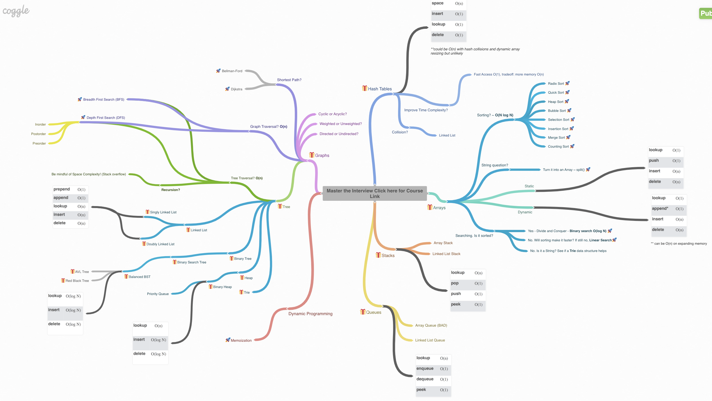

## Introduction 

Data structure is a collection or arrangement of values 
 a. Values can have relations or functions among them
 b. Way for us to organize and retrieve data (put and get)
 c. Ex Bitcoin uses BlockChain DS to hold the data
 
Algorithms are the steps/process we put into place to manipulate these DS 

Data structures + algorithms = Programs 

### How Computers store data

CPU : Lot faster to access RAM than storage
RAM : variables stored here, Space complexity, lose after you turn off
      massive storage area, kinda like DS (Dictionary address: 8Bit/byte)
Storage : Persistent, don't lose data, slow, Files/Docs 

integers = 32/64 bits 4-8 bytes

### Summary
DS is an arrangement of data in RAM, some next to and some apart with different pros 
and cons to access and write

Our goal is to minimize the operation for CPU to get/write the information 

https://statmath.wu.ac.at/courses/data-analysis/itdtHTML/node55.html

Watch: https://www.youtube.com/watch?v=fpnE6UAfbtU

